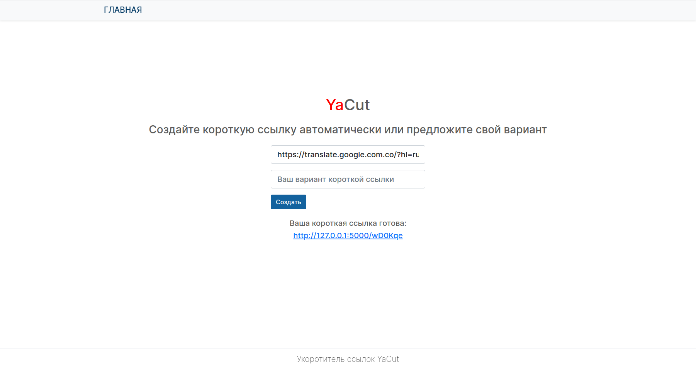

# $${\color{red}Create}Link$$

Сервис укорачивания ссылок связывает оригинальную (длинную) ссылку с компактной (от 1 до 16 символов). Короткий вариант ссылки может быть задан как самим пользователем (1 - 16 символов), так и сгенерирован автоматически (ссылка будет состоять из 6 случайных символов).

## Технологии

[](https://www.python.org/)  
[](https://palletsprojects.com/p/flask/)  
[](https://flask-api.readthedocs.io/en/latest/#)  
[](https://flask-sqlalchemy.palletsprojects.com/en/latest/)  
[](https://palletsprojects.com/p/jinja/)  
[](https://wtforms.readthedocs.io/en/master/)  
[](https://www.sqlite.com/version3.html)

## Описание работы:
Ключевые возможности сервиса:
  * генерация коротких ссылок и связь их с исходными длинными ссылками,
  * переадресация на исходный адрес при обращении к коротким ссылкам.

Пользовательский интерфейс сервиса — одна страница с формой. Эта форма состоит из двух полей:
  * обязательного - для длинной исходной ссылки;
  * необязательного - для пользовательского варианта короткой ссылки (не должен превышать 16 символов).

Если пользователь предложит вариант короткой ссылки, который уже занят, то сервис сообщит пользователю об этом, и существующая в базе данных ссылка остается неизменной.

Если пользователь не заполнит поле со своим вариантом короткой ссылки, то сервис сгенерирует уникальную ссылку автоматически и добавит ее в базу данных.
Формат для ссылки по умолчанию — шесть случайных символов, в качестве которых будут использованы:
  * большие латинские буквы,
  * маленькие латинские буквы,
  * цифры в диапазоне от 0 до 9.

После отправки формы на главной странице отображается созданная ссылка.  

**Пример HTML-страницы с заполненной формой и созданной короткой ссылкой:**



Tак же сервис предоставляет взаимодействие через API, который доступен всем. Сервис обслуживает два эндпоинта:
  * /api/id/ — POST-запрос на создание новой короткой ссылки;
  * /api/id/<имя_короткой_ссылки>/ — GET-запрос на получение оригинальной ссылки по указанному короткому идентификатору.

**Пример POST-запроса к API-проекта и ответа:**  
Эндпоинт http://127.0.0.1:5000/api/id/  
Request  
```
{
    "url": "  https://flask.palletsprojects.com/en/2.3.x/blueprints/"
}
```
Response  
```
{
    "short_link": "http://127.0.0.1:5000/S0tsHQ",
    "url": "  https://flask.palletsprojects.com/en/2.3.x/blueprints/"
}
```
## Установка и запуск проекта
Клонировать репозиторий и перейти в него в командной строке:

```
git clone https://github.com/Iv-EN/yacut.git
```

```
cd yacut
```

Cоздать и активировать виртуальное окружение:

```
python3 -m venv venv
```

* Если у вас Linux/macOS

    ```
    source venv/bin/activate
    ```

* Если у вас windows

    ```
    source venv/scripts/activate
    ```

Установить зависимости из файла requirements.txt:

```
python3 -m pip install --upgrade pip
```

```
pip install -r requirements.txt
```
Запустить командой:
```
flask run
```
## Автор
[Евгений Иванов](https://github.com/Iv-EN)
